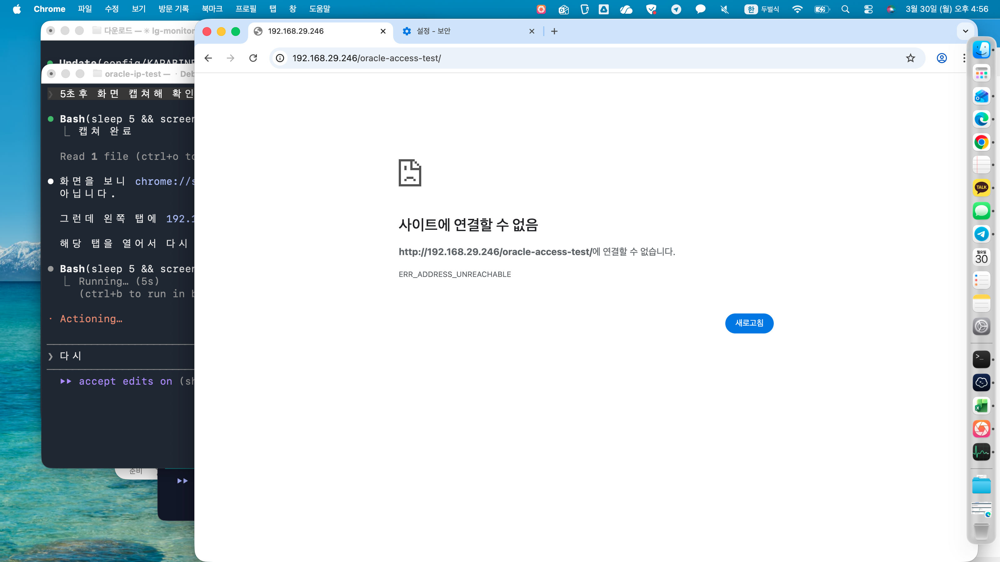
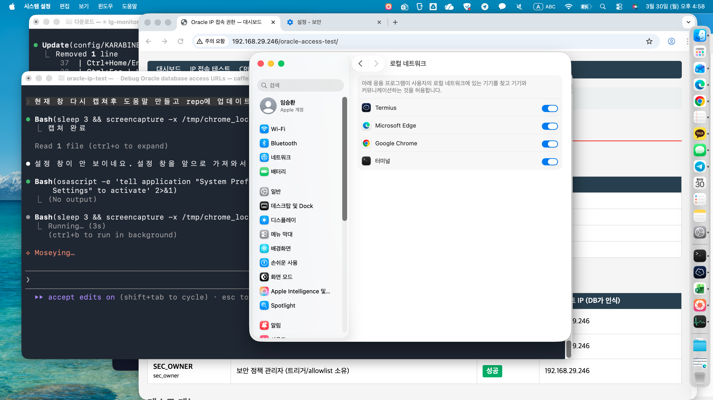

# Chrome 로컬 네트워크 접속 불가 해결 가이드

## 증상

Chrome에서 내부 IP(예: `http://192.168.29.246/oracle-access-test/`)에 접속하면 **ERR_ADDRESS_UNREACHABLE** 에러가 발생한다.



- Edge 등 다른 브라우저에서는 정상 접속됨
- `curl`로는 정상 접속됨
- 같은 서브넷의 게이트웨이(192.168.29.1)는 Chrome에서도 접속됨

## 원인

macOS의 **로컬 네트워크 접근 권한**이 Chrome에 대해 거부되어 있기 때문이다.
macOS Sonoma 이상에서는 앱별로 로컬 네트워크 접근을 제어하며, 최초 접속 시 나타나는 팝업에서 "허용 안 함"을 선택하면 이후 로컬 IP에 접속할 수 없다.

## 해결 방법

### 1. 시스템 설정에서 권한 켜기

1. **시스템 설정** > **개인정보 보호 및 보안** > **로컬 네트워크** 이동 (스크롤을 내려야 보임)
   - 터미널에서 바로 열기: `open "x-apple.systempreferences:com.apple.preference.security?Privacy_LocalNetwork"`
2. **Google Chrome** 토글을 **켜기**로 변경



3. Chrome을 **완전 종료**(Cmd+Q) 후 다시 실행

### 2. 목록에 Chrome이 없는 경우

Chrome이 로컬 네트워크 접근을 한 번도 시도하지 않았거나 TCC 레코드가 없는 상태이다.

1. Chrome 완전 종료 (Cmd+Q)
2. Chrome 사용자 데이터 삭제:
   ```bash
   rm -rf ~/Library/Application\ Support/Google/Chrome
   rm -rf ~/Library/Caches/Google/Chrome
   rm -rf ~/Library/Preferences/com.google.Chrome*
   rm -rf ~/Library/Saved\ Application\ State/com.google.Chrome.savedState
   ```
3. Chrome 앱 삭제 후 재설치:
   ```bash
   sudo rm -rf "/Applications/Google Chrome.app"
   bash 0620_chrome-business.sh
   ```
4. Chrome 실행 후 로컬 IP에 접속하면 권한 팝업이 다시 나타남 > **허용** 선택

## 참고

- `upgrade-insecure-requests: 1` 헤더는 이 문제와 무관하다 (HTTPS 강제 아님)
- macOS의 로컬 네트워크 권한은 앱 번들 ID(`com.google.Chrome`) 기준으로 관리된다
- Chrome 앱만 삭제/재설치해도 `~/Library` 아래 사용자 데이터는 유지되므로, 완전 초기화가 필요하면 사용자 데이터까지 삭제해야 한다
